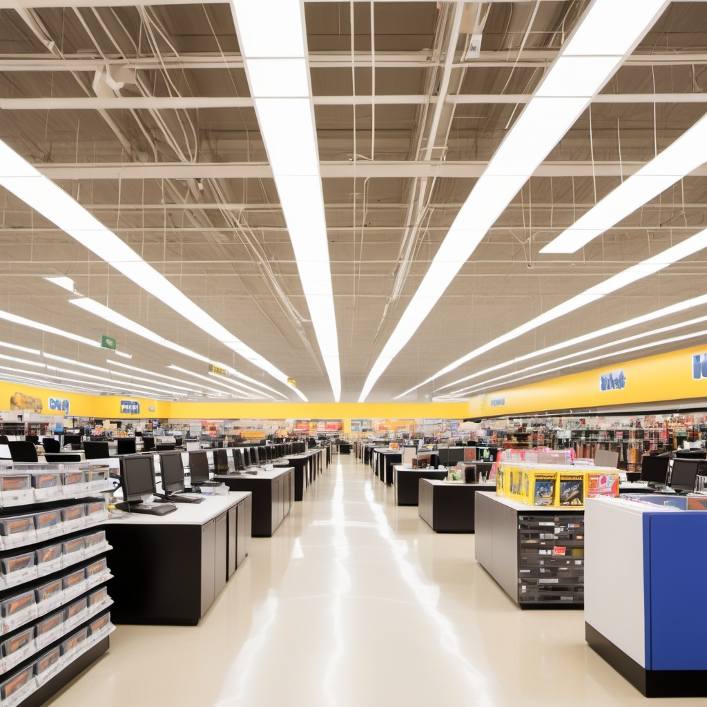

# Superstore Sales Analysis with Python

## Content
+ [Introduction](#introduction)
+ [Project Overview](#project-overview)
+ [Dataset Information](#dataset-information)
+ [Main Conclusions](#main-conclusions)

## Introduction  
Data analysis and visualization was performed using Python libraries:

1.  Numpy
2.	Pandas
3.	Matplotlib
4.	Seaborn  
5.	Plotly

__Data analysis took place in several stages:__ 
+ Exploratory data analysis  
+ Analyzing segments  
+ Analyzing customers  
+ Analyzing the Mode of Shipping  
+ Analyzing Sales by region state and city  
+ Product Analysis by Category and Sub-category  
+ Sales Trend Analysis  

## Project Overview
  Superstore is a store based in the United States. The dataset contains a wide range of information about sales transactions: 
+ Shape: 9993 rows, 20 columns.
+ Period covered: the data covers the period from 2019 to 2022.  
+ Geographical Coverage: sales data from superstores across the USA.

## Dataset Information
+ __Order ID__ - a unique identifier for each order. Column Order ID has unique rows.
+ __Order Date__ - the date that a customer has completed the transaction and made a purchase. The dataset contains information for 4 years (from 2019 to 2022).
+ __Ship Date__ - the date that an order is shipped from the seller or warehouse to the end customer.  The dataset contains information for 4 years (from 2019 to 2022).
+ __Ship Mode__ - types of goods delivery. Ship Mode has 4 categories: First Class, Second Class, Same Day, and Standard Class.           
+ __Customer ID__ - a unique number used to identify customers. There are 793 customers in the dataset.
+ __Customer Name__ - names of customers.
+ __Segment__ - the superstore divides the market into 3 categories: Consumer, Corporate, Segment.          
+ __Country__ - the superstore is based in the United States.    
+ __Region__ - the company sold the products in all regions of the USA (Central, East, South, West).
+ __State__ - the company sold the products in 49 States of America. 
+ __City__ - the company sold the products in 531 cities.                
+ __Postal Code__ - a set of specific numbers that helps postal services deliver mail.                   
+ __Product ID__ - a permanent, unique identifier assigned to a data product by its producer.  The dataset contains 1862 different products.            
+ __Category__ - the company specializes in selling furniture, office supplies, and technology products: furniture, office supplies, and technology products
+ __Sub-Category__ - each category has a sub-category. Office supplies have 9, furniture has 4 and technology has 4 sub-categories respectively.
+ __Product Name__ - there are 1850 different products.         
+ __Sales__ - total sales were $2296919 and the average sales value reached $230.
+ __Quantity__ - the company sold 37871 products.
+ __Discount__ - the average discount reached 16%, the minimum discount was 0% (without discount), and maximum discount - 80%.
+ __Profit__ - total profit was $286409 and the average profit was $29 per product.

## Main Conclusions

### Analyzing customer segments:
The consumer segment had the highest number of customers with 5191 customers (52% of all customers) and this segment also had the highest sales of $1161401 and profit of $134119. Superstores should increase sales in the consumer segment with a specific marketing strategy. The corporate and home office segment presents a great opportunity for growth by utilizing the B2B strategies.

### Analyzing customers:
There are 793 customers in the dataset. 
Top customers by number of orders: William Brown with 37 orders, Paul Prost, John Lee, and Matt Abelman with 34 orders. Top customers by sales volume: Sean Miller with $25043, Tamara Chand with $19052, and Raymond Buch with $15117.

### Analyzing the Mode of shipping:
There are 4 main shipping modes: Standard Class (59.7%), Second Class (19.5%), First Class (15.4%), Same Day (5.4%). Most customers preferred Standard Class shipping, indicating they might prioritize cost savings over faster delivery.

### Analyzing sales by region, state and city:
The West region had the highest revenue with sales of $725458, followed by the East region with sales of $678500. The states with the best sales were California with $457688, New York with $310876, and Texas with $170188. As far as cities are concerned, the biggest sales were recorded in New York City with $256368, Los Angeles with $175851, and Seattle with $175851. Therefore, the company should focus on these states to further increase sales.

### Product Analysis by Category and Sub-category:
The supermarket sold 3 categories of goods: office supplies, furniture and technology. The technology category ranked first in terms of sales and profitability. This category contains phones with the highest sales at $330007 and second place in profitability at $44516. Furniture showed significant sales. For example, copies brought in the highest profit of $55618. On the other hand, tables and bookcases showed decent losses, and accessories made a loss. The company must change its pricing strategy for unprofitable products.

### Sales Trend Analysis:
Dynamics shows that the biggest sales were in November 2022. As for profits, the biggest one was in December 2021. The company's losses were incurred during 2019 and 2020.
